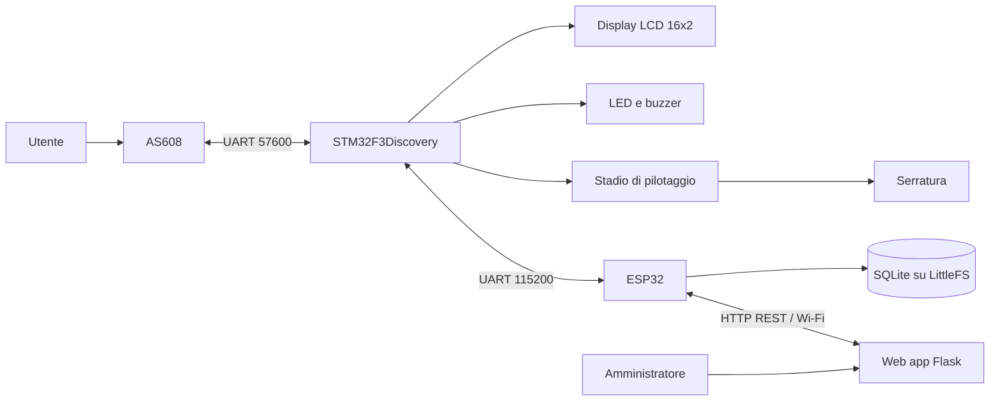

# Smart Lock biometrica

Sistema embedded di controllo accessi sviluppato per il progetto d'esame di
**Architettura e Progetto dei Calcolatori**.

La serratura riconosce l'impronta digitale tramite un sensore **AS608** e
consente l'accesso soltanto agli utenti registrati e abilitati. Il sistema
integra una scheda **STM32F3Discovery**, un **ESP32** e un pannello web per
amministrare utenti, permessi ed eventi.

## Funzionalita

- riconoscimento biometrico locale tramite AS608;
- apertura temporizzata della serratura per gli utenti autorizzati;
- registrazione guidata di nuove impronte;
- associazione tra ID biometrico e dati dell'utente;
- attivazione e revoca dei permessi di accesso;
- eliminazione sincronizzata da AS608 e database SQLite;
- reset completo del database biometrico e degli utenti;
- storico degli accessi consentiti, negati e sconosciuti;
- feedback tramite display LCD, LED e buzzer;
- pannello di amministrazione protetto da login.

## Architettura



Le responsabilita sono suddivise tra tre livelli:

1. **STM32**: gestisce il sensore biometrico, la macchina a stati, il display,
   i segnali acustici e l'attuatore della serratura.
2. **ESP32**: verifica i permessi, conserva gli utenti in SQLite, registra gli
   eventi ed espone le API HTTP.
3. **Web app**: offre l'interfaccia amministrativa e inoltra le operazioni
   all'ESP32 senza esporre direttamente la sua API al browser.

I template biometrici restano nella memoria del sensore AS608. Nel database
SQLite vengono salvati soltanto ID, nome, ruolo e stato del permesso.

## Flusso di autenticazione

1. Il sensore segnala alla STM32 la presenza di un dito.
2. La STM32 acquisisce l'impronta e cerca una corrispondenza nella libreria
   locale dell'AS608.
3. Se viene trovato un ID, la STM32 invia `AUTH_REQUEST:<id>` all'ESP32.
4. L'ESP32 verifica nel database che l'utente esista e sia abilitato.
5. L'ESP32 risponde con `AUTH_RESULT:<id>:GRANTED` oppure `DENIED`.
6. In caso di autorizzazione la STM32 attiva la serratura per un secondo,
   accende il LED verde e riproduce il segnale di conferma.
7. In caso contrario mostra l'accesso negato, accende il LED rosso e genera
   tre segnali acustici.

## Componenti

- scheda STM32F3Discovery con MCU STM32F303;
- scheda ESP32;
- sensore di impronte digitali AS608;
- display LCD 16x2 compatibile HD44780, usato in modalita 4 bit;
- buzzer;
- serratura elettrica o solenoide;
- stadio di pilotaggio per la serratura, con alimentazione e protezioni
  adeguate al carico;
- collegamenti UART e massa comune tra i moduli.

> La serratura non deve essere alimentata direttamente da un GPIO della
> STM32. Utilizzare un driver, MOSFET o rele dimensionato correttamente e una
> protezione contro i transitori del carico induttivo.

## Collegamenti principali

### STM32 - AS608

| Funzione | STM32 | Configurazione |
| --- | --- | --- |
| TX verso AS608 | `PA2` / USART2_TX | 57600 baud, 8N1 |
| RX da AS608 | `PA3` / USART2_RX | 57600 baud, 8N1 |
| Touch detect | `PC5` / EXTI5 | Interrupt sul fronte di salita |

### STM32 - ESP32

| STM32 | ESP32 | Funzione |
| --- | --- | --- |
| `PA9` / USART1_TX | `GPIO16` / RX2 | STM32 verso ESP32 |
| `PA10` / USART1_RX | `GPIO17` / TX2 | ESP32 verso STM32 |
| GND | GND | Massa comune |

La comunicazione utilizza 115200 baud, 8N1.

### Periferiche STM32

| Periferica | Pin |
| --- | --- |
| LCD RS | `PD8` |
| LCD EN | `PD9` |
| LCD D4-D7 | `PD10`-`PD13` |
| Buzzer | `PB8` |
| Comando serratura | `PB9` |
| LED rosso | `PE9` / LD3 |
| LED verde | `PE11` / LD7 |
| Pulsante reset DB all'avvio | `PA0` |

Verificare sempre tensioni, alimentazioni e livelli logici sui datasheet dei
moduli effettivamente utilizzati.

## Struttura del repository

```text
Progetto-APC/
|-- APC_Progetto/               # Progetto STM32CubeIDE
|   |-- Core/Inc/               # Header applicativi e driver
|   |-- Core/Src/               # Firmware STM32
|   `-- APC_Progetto.ioc        # Configurazione STM32CubeMX
|-- progetto_APC_ESP32/
|   `-- progetto_APC_ESP32.ino  # Firmware ESP32
|-- pc_web_app/
|   |-- static/                 # CSS e JavaScript
|   |-- templates/              # Template HTML
|   |-- app.py                  # Server Flask
|   `-- requirements.txt        # Dipendenze Python
`-- README.md
```

## Installazione

### 1. Firmware STM32

Requisiti:

- STM32CubeIDE;
- programmatore/debugger ST-LINK integrato nella STM32F3Discovery.

Procedura:

1. Aprire STM32CubeIDE.
2. Importare `APC_Progetto` come progetto esistente.
3. Compilare il progetto.
4. Collegare la scheda tramite ST-LINK.
5. Eseguire il flash e avviare il firmware.

All'avvio il firmware verifica la comunicazione con l'AS608. Tenendo premuto
il pulsante `PA0` durante l'accensione viene richiesta la cancellazione della
libreria biometrica.

### 2. Firmware ESP32

Lo sketch richiede:

- supporto ESP32 per Arduino;
- ArduinoJson;
- una libreria SQLite per ESP32 compatibile con `sqlite3.h`;
- LittleFS, WiFi e WebServer inclusi nel core ESP32.

Prima del caricamento, configurare nello sketch:

```cpp
const char* SSID      = "NOME_RETE";
const char* WIFI_PASS = "PASSWORD_RETE";
const char* API_KEY   = "CHIAVE_API_LUNGA_E_CASUALE";
```

Aprire `progetto_APC_ESP32/progetto_APC_ESP32.ino`, selezionare la scheda e la
porta corrette, quindi compilare e caricare il firmware. L'indirizzo IP
assegnato all'ESP32 deve essere inserito nella configurazione della web app.

### 3. Web app

E' consigliato Python 3.11 o successivo.

Da PowerShell:

```powershell
cd pc_web_app
python -m venv .venv
.\.venv\Scripts\Activate.ps1
python -m pip install -r requirements.txt
Copy-Item .env.example .env
```

Configurare `pc_web_app/.env`:

```dotenv
APP_SECRET_KEY=una-chiave-lunga-e-casuale
APP_ADMIN_USER=admin
APP_ADMIN_PASS=una-password-sicura
ESP32_BASE_URL=http://IP_ESP32
ESP32_API_KEY=la-stessa-chiave-impostata-sull-esp32
```

Avviare l'applicazione:

```powershell
python app.py
```

Il pannello sara disponibile all'indirizzo
[http://localhost:5000](http://localhost:5000). Da un altro dispositivo nella
stessa rete utilizzare `http://IP_DEL_PC:5000`.

## Utilizzo

### Registrazione di un utente

1. Accedere al pannello web.
2. Inserire nome e cognome.
3. Avviare la registrazione.
4. Appoggiare il dito quando richiesto dal display.
5. Rimuoverlo e appoggiarlo una seconda volta.
6. Al termine, l'AS608 assegna il primo slot libero tra 1 e 127 e l'ESP32
   crea l'utente nel database.

### Gestione degli accessi

Dal pannello e possibile:

- modificare nome e ruolo;
- abilitare o revocare l'accesso senza cancellare l'impronta;
- eliminare un singolo utente e il relativo template biometrico;
- consultare gli eventi recenti;
- azzerare sia la libreria AS608 sia il database SQLite.

## API ESP32

Tutte le richieste richiedono l'header `X-API-KEY`.

| Metodo | Endpoint | Descrizione |
| --- | --- | --- |
| `GET` | `/api/health` | Stato del servizio |
| `POST` | `/api/enroll` | Avvio registrazione |
| `GET` | `/api/enroll/status` | Stato registrazione |
| `GET` | `/api/events` | Eventi successivi a un ID |
| `GET` | `/api/users` | Elenco utenti |
| `PATCH` | `/api/users` | Modifica utente o permesso |
| `DELETE` | `/api/users` | Eliminazione utente |
| `POST` | `/api/reset` | Reset completo |

Esempio di controllo:

```powershell
Invoke-RestMethod `
  -Uri "http://IP_ESP32/api/health" `
  -Headers @{ "X-API-KEY" = "LA_CHIAVE_API" }
```

## Affidabilita

Il firmware include alcuni accorgimenti specifici per un sistema embedded:

- ricezione UART STM32 gestita tramite interrupt;
- riarmo della UART dopo errori di framing, rumore o overrun;
- scarto sull'ESP32 delle righe UART contaminate da byte non ASCII;
- timeout sulle comunicazioni e sulla procedura di registrazione;
- verifica della cancellazione effettiva dei template;
- fallback con eliminazione slot per slot se il reset globale AS608 fallisce;
- prepared statement SQLite per le operazioni sugli utenti.
